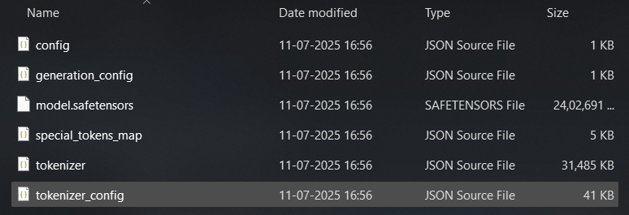

# Lunor Translator 🔮
<p align="center">
  
</p>

<p align="center">
  
  
  
  
</p>

<p align="center">
  
</p>

<p align="center">
  <strong>A cross-platform, offline, AI-powered translation application for fast, private, and accurate multilingual communication.</strong>
</p>

---

## Table of Contents

1.  [Overview](#overview)
2.  [Key Features](#key-features)
3.  [Core Technology & Performance](#core-technology--performance)
4.  [Technology Stack](#technology-stack)
5.  [Repository Structure](#repository-structure)
6.  [Installation and Usage](#installation-and-usage)
    * [Prerequisites](#prerequisites)
    * [Backend Setup](#backend-setup)
    * [Frontend Setup](#frontend-setup)
7.  [Future Work](#future-work)
8.  [Contact](#contact)

---

## Overview

In an era where information is critical, language barriers pose a significant challenge, especially in sectors requiring high security and data privacy. Commercial online translation services, while powerful, are not viable solutions due to their reliance on internet connectivity and the inherent security risks of sending sensitive data to third-party servers.

**Lunor Translator** was built to solve this problem. It's a desktop application that brings the power of state-of-the-art neural machine translation directly to your machine. It operates **entirely offline**, ensuring that your data never leaves your computer. The application is powered by Meta's groundbreaking **NLLB-200 (No Language Left Behind)** model, providing high-quality, nuanced translations for over 200 languages.

---

## Key Features

* 🔒 **Completely Offline:** All translation is processed locally. No data ever leaves your computer.
* ⚡ **State-of-the-Art Accuracy:** Powered by the NLLB-200 model for high-quality translation.
* 🌐 **Cross-Platform:** Designed to run natively on Windows, macOS, and Linux.
* ✨ **Modern UI:** A clean, intuitive, and responsive user interface built with React and Tauri.
* 📂 **Custom Model Support:** Load any compatible Hugging Face model from your local filesystem.

---

## Core Technology & Performance

Lunor Translator is powered by Meta's **NLLB-200 (No Language Left Behind)** model family, the state-of-the-art in open-source multilingual translation. This model was chosen after a comprehensive evaluation against other models like M2M100 and online baselines.

#### State-of-the-Art Burmese Translation
A key success of this project was demonstrating the application's powerful capabilities for low-resource languages. In benchmark tests on a custom-curated dataset, Lunor Translator achieved a **BLEU score of 25.02** for Burmese-to-English translation. This result significantly surpassed the Google Translate baseline, which scored **9.14**, proving the immense potential of using high-quality offline models for languages that are often underserved by major online platforms.

| Model                 | Burmese-English BLEU Score |
| :-------------------- | :------------------------- |
| Google Translate      | 9.14                       |
| **NLLB-200 1.3B** | **25.02** |

---

## Technology Stack

| Category          | Technology                                   |
| :---------------- | :------------------------------------------- |
| **AI/ML Model** | Facebook NLLB-200                            |
| **Backend** | Python, FastAPI, Hugging Face `transformers` |
| **Frontend** | React.js, Next.js, shadcn/ui                 |
| **Desktop Framework**| Tauri (with Rust Core)                       |

---

## Repository Structure

The project is organized with a clear separation between the frontend application and the backend scripts.


```
nllb/
├── app/                  # The React/Tauri frontend application
│   ├── components/
│   └── ...
├── scripts/
│   └── backend/          # The Python backend server
│       ├── main.py
│       ├── run_server.py
│       └── requirements.txt
└── ... (other config files)


---
```
## Installation and Usage

Follow these instructions to set up and run the application from the source code.

### Prerequisites

Ensure you have the following installed on your system:
* **Python** (version 3.10 or higher)
* **Node.js** (LTS version)
* **Git**
* **Rust** (via `rustup`). If you don't have Rust, expand the guide below.
* You can download a small **[NLLB-200 Distilled 600M](https://drive.google.com/file/d/1QFxUir2C1NSKYo_OApvQDNaowKijDj9P/view?usp=sharing)** model directly from here

A model should have these files 
<p align="center">
  
</p>

**Note: Instead of `model.safetensors`, you can have `pytorch_model.bin`. Make sure names are correct as shown.**
<details>
<summary><strong>🔥 Click here for the Rust Installation Guide (Windows, Mac, Linux)</strong></summary>

---
### 🖥️ Windows Guide (the easy way)

1.  **Download and run `rustup-init.exe`:**
    * Go to the official Rust website: [rust-lang.org](https://www.rust-lang.org/tools/install)
    * Download the 64-bit installer and run it.

2.  **Install the C++ tools when it asks:**
    * The installer will probably say you need "Microsoft C++ Build Tools". Press `Enter` to let it install them for you. This is required for linking.

3.  **Let it do its thing:**
    * When it prompts you, just choose option `1` for the default installation.
    * It will automatically update your PATH.

4.  **Restart your terminal:**
    * Close your current terminal (CMD, PowerShell, etc.) and open a new one for the PATH changes to take effect.

5.  **✅ Verify it's working:**
    ```bash
    rustc --version
    cargo --version
    ```
    If you see version numbers, you're good to go.

6.  **🚫 If you see "command not found":**
    * It means the installer failed to update your PATH. No biggie, we'll do it manually.
    * Press the Windows key and search for "env".
    * Click on "Edit the system environment variables".
    * In the new window, click the "Environment Variables..." button.
    * In the top box ("User variables"), find the `Path` variable and click "Edit...".
    * Click "New" and paste in this exact line: `%USERPROFILE%\.cargo\bin`
    * Click OK on all the windows to close them.
    * **Restart your terminal** one more time. The commands should work now.

---
### 🍏 macOS Guide (M1/M2/M3 gang)

1.  **Run the Rust installer:**
    ```bash
    curl --proto '=https' --tlsv1.2 -sSf [https://sh.rustup.rs](https://sh.rustup.rs) | sh
    ```
    * Choose option `1` (standard install) when prompted.

2.  **Activate Rust for your current session:**
    ```bash
    source "$HOME/.cargo/env"
    ```
    ^ this makes it work *right now*.

3.  **Permanently fix your PATH (so you don't have to run that `source` command every time):**
    * Add this line to your `~/.zshrc` file (or `~/.bash_profile` if you use bash):
        ```bash
        export PATH="$HOME/.cargo/bin:$PATH"
        ```
    * Then, reload your shell config:
        ```bash
        source ~/.zshrc
        ```

4.  **✅ Verify it's working:**
    ```bash
    rustc --version
    cargo --version
    ```
    If you see version numbers, you're g2g.

---
### 🐧 Linux Guide (Ubuntu/Debian/etc.)

1.  **Run the Rust installer (same as Mac):**
    ```bash
    curl --proto '=https' --tlsv1.2 -sSf [https://sh.rustup.rs](https://sh.rustup.rs) | sh
    ```
    * Choose option `1` for the default installation.
    * You might need to install `build-essential` first if you get errors: `sudo apt-get install build-essential`

2.  **Activate Rust for your current session:**
    ```bash
    source "$HOME/.cargo/env"
    ```

3.  **Permanently fix your PATH:**
    * The installer usually does this for you by adding a line to `~/.profile` or `~/.bashrc`.
    * If it doesn't work after restarting your terminal, add this line to your `~/.bashrc` or `~/.zshrc`:
        ```bash
        export PATH="$HOME/.cargo/bin:$PATH"
        ```
    * Then, reload your shell config:
        ```bash
        source ~/.bashrc
        ```

4.  **✅ Verify it's working:**
    ```bash
    rustc --version
    cargo --version
    ```
    If you see version numbers, you're set.

</details>

* **(Windows Only)** **WiX Toolset v3**: Required by Tauri to build the Windows installer (`.msi`). [Download the `wix314.exe` installer here](https://github.com/wixtoolset/wix3/releases/tag/wix3141rtm).

### Backend Setup

1.  **Navigate to the backend directory:**
    ```bash
    cd nllb/scripts/backend
    ```
2.  **(Recommended) Create and activate a virtual environment:**
    * **Windows:** `python -m venv venv` followed by `.\venv\Scripts\activate`
    * **macOS / Linux:** `python3 -m venv venv` followed by `source venv/bin/activate`
3.  **Install Python dependencies:**
    ```bash
    pip install -r requirements.txt
    ```
4.  **Run the backend server:**
    * **Windows:**
        ```bash
        python run_server.py
        ```
    * **macOS / Linux:**
        ```bash
        python3 run_server.py
        ```
    The server will start on `http://localhost:8000`. **Keep this terminal window open.**

### Frontend Setup

Open a **new terminal window**.

1.  **Navigate to the frontend directory:**
    ```bash
    cd nllb/app
    ```
2.  **Install Node.js dependencies:**
    ```bash
    npm install
    ```
3.  **Launch the Lunor Translator application:**
    ```bash
    npm run tauri dev
    ```
    The desktop application window will launch. You can now load a model via the settings panel and start translating.

---

## Future Work

* **Standalone Executable:** Solve the Tauri sidecar challenge to bundle the Python backend into a single, double-clickable application.
* **Model Fine-Tuning:** Create a larger, cleaner corpus for specific language pairs and fine-tune NLLB to reduce errors like named entity hallucinations.
* **Feature Expansion:** Add more features, such as full document translation and expanding Text-to-Speech (TTS) support.

---

## Contact

Harsh Tripathi - [harsht@iitbhilai.ac.in](mailto:harsht@iitbhilai.ac.in)
